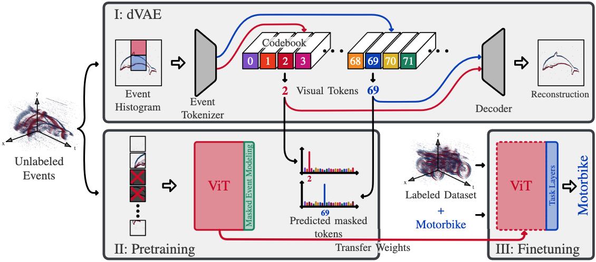

# Masked Event Modelling: Self-Supervised Pretraining for Event Cameras
Link to paper: https://arxiv.org/abs/2212.10368v1

Event cameras asynchronously capture brightness changes with low latency, high temporal resolution, and high dynamic range. However, annotation of event data is a costly and laborious process, which limits the use of deep learning methods for classification and other semantic tasks with the event modality. To reduce the dependency on labeled event data, we introduce Masked Event Modeling (MEM), a self-supervised framework for events. Our method pretrains a neural network on unlabeled events, which can originate from any event camera recording. Subsequently, the pretrained model is finetuned on a downstream task, leading to a consistent improvement of the task accuracy.
For example, our method reaches state-of-the-art classification accuracy across three datasets, N-ImageNet, N-Cars, and N-Caltech101, increasing the top-1 accuracy of previous work by significant margins. When tested on real-world event data, MEM is even superior to supervised RGB-based pretraining. The models pretrained with MEM are also label-efficient and generalize well to the dense task of semantic image segmentation.



Citation:
```
@inproceedings{masked-event-modeling,
      title={Masked Event Modeling: Self-Supervised Pretraining for Event Cameras}, 
      author={Simon Klenk, David Bonello, Lukas Koestler, Nikita Araslanov and Daniel Cremers},
      booktitle=WACV,
      year={2024}
}
```

## Setup

First, create the project directory
```
mkdir masked-event-modelling
cd masked-event-modelling
```

Clone the repo
```
git clone https://github.com/tum-vision/mem
cd mem
```

Install miniconda (https://docs.conda.io/en/latest/miniconda.html) and set up the environment
```
conda create --name mem python=3.10
conda activate mem
```

Install pytorch (https://pytorch.org/get-started/locally/)

Install Requirements
```
pip install -r requirements.txt
```


### Datasets

Install an event dataset. Here we will install N-Caltech101.

Create a directory for the datasets in the project directory
```bash
cd ..
mkdir datasets
cd datasets
```

Install N-Caltech101, unzip it and extract the files
```bash
wget -O ncaltech101-raw.zip https://prod-dcd-datasets-cache-zipfiles.s3.eu-west-1.amazonaws.com/cy6cvx3ryv-1.zip
unzip ncaltech101-raw.zip
unzip cy6cvx3ryv-1/Caltech101.zip
rm ncaltech101-raw.zip
rm -r cy6cvx3ryv-1
```

Preprocess the dataset
```bash
python ../mem/process_data/process_dataset.py --dataset ncaltech101 --cores 4 --input Caltech101 --output ncaltech101 --split ../mem/configs/splits/ncaltech101.txt
```

Removew the raw dataset
```bash
rm -r Caltech101
```


### Logging

Logging is done with Weights & Biases. Log in with your account.

```bash
wandb login
```


## Training

Training can be done in one of two ways: locally or on a slurm cluster.

The pipeline sets up a new directory with the config files and scripts needed to run the experiment. It then submits the experiment to a slurm cluster if wanted.

To train with the pipeline, create a config file (like the ones in `mem/configs`) and run one of the following commands while in the `mem` directory

### Local training

```bash
./run-pipeline.sh ./configs/ncaltech.conf
```

### Training on SLURM cluster

```bash
cd mem
./run-pipeline.sh ./configs/ncaltech.conf slurm
```


## Semantic Segmentation

Follow the README in `mem/semantic_segmentation` to train a semantic segmentation model.


## Attribution

- This code is based on Microsoft's BEiT code (https://github.com/microsoft/unilm/tree/master/beit).
- The eventVAE code is based on Phil Wang's code (https://github.com/lucidrains/DALLE-pytorch)
